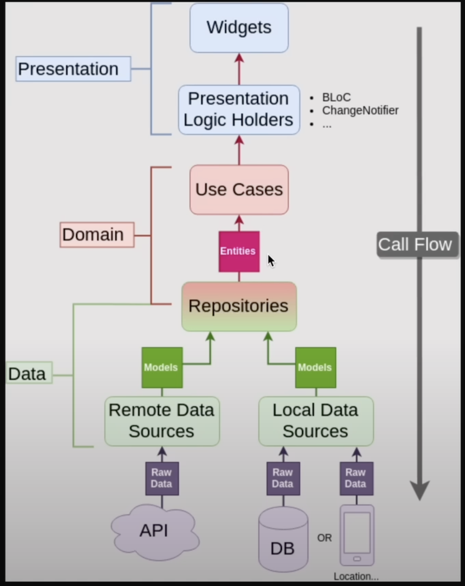

# Dwell FI Assignment

## Table of Contents
- [Introduction](#introduction)
- [Architecture](#architecture)
- [Features](#features)
- [Dependencies](#dependencies)
- [Project Structure](#project-structure)
- [Code Explanation](#code-explanation)
- [How to Run](#how-to-run)

## Introduction
 Designed to manage file uploads, process notifications, and display file metrics. This application uses the BLoC (Business Logic Component) pattern for state management and integrates with a backend server for file operations and notifications.

## Architecture

The project follows a clean architecture approach, separating the application into different layers:
- **Presentation Layer**: Contains the UI and BLoC for state management.
- **Domain Layer**: Contains business logic and entities.
- **Data Layer**: Handles data operations, including network requests and data parsing.

### BLoC Pattern
The BLoC pattern is used to manage the state of the application. It helps in separating business logic from the UI, making the code more modular and testable.

## Features
- **File Upload**: Users can upload JSON files.
- **File Processing**: The application processes the uploaded files and updates their status.
- **Notifications**: Users receive notifications about file processing status.
- **Metrics Display**: Displays file metrics using charts.
- **Authentication**: Basic authentication flow with login functionality.

## Dependencies
- `flutter_bloc`: For state management using the BLoC pattern.
- `dio`: For making network requests.
- `file_picker`: For picking files from the device.
- `flutter_local_notifications`: For displaying local notifications.
- `get_it`: For dependency injection.

## Project Structure
The project is organized as follows:

- **lib/core**: Contains core components such as constants, models, and utilities.
- **lib/features**: Contains feature-specific code.
  - **file_feature**: Handles file upload, processing, and metrics display.
  - **auth_feature**: Manages authentication flow.
- **lib/presentation**: UI components and BLoC implementations.
- **lib/data**: Data operations and network requests.
- **lib/domain**: Business logic and entities.

## Code Explanation
The code is organized as follows:

- **lib/core**: Contains core components such as constants, models, and utilities.
- **lib/features**: Contains feature-specific code.
  - **file_feature**: Handles file upload, processing, and metrics display.
  - **auth_feature**: Manages authentication flow.
- **lib/presentation**: UI components and BLoC implementations.
- **lib/data**: Data operations and network requests.

## How to Run
To run the application, follow these steps:

1. Clone the repository.
2. Run `flutter pub get` to install dependencies.
3. Run `flutter run` to start the application.

